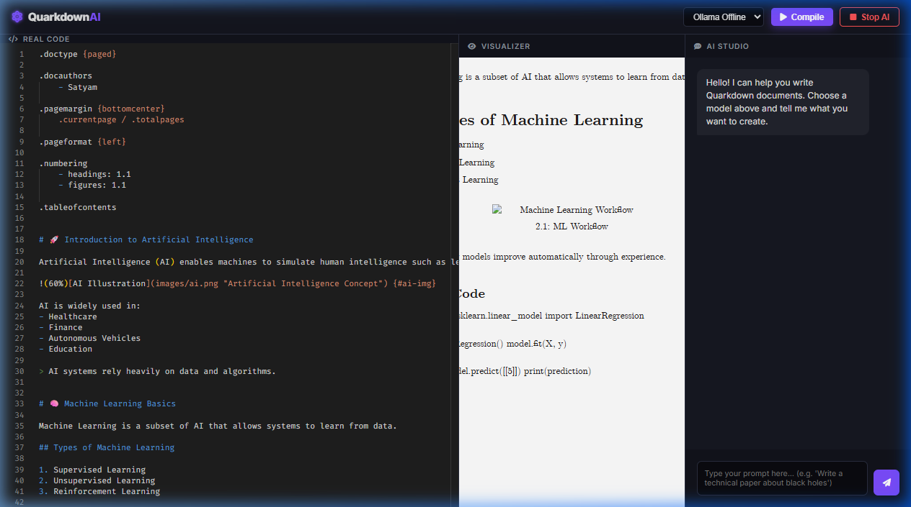

# LayerDocs

  

**LayerDocs** is a versatile Markdown-based typesetting system designed for modularity and depth.

## Features

- **Modular Syntax**: Use `.function {arg}` for powerful document control.
- **AI Studio**: Interactive editor with real-time preview and Ollama integration.
- **Premium Themes**: Built-in support for high-quality PDF and HTML outputs.
- **Lightweight & Fast**: Built with Kotlin and modern web technologies.

## Author

- **SatyamPote** - [GitHub](https://github.com/SatyamPote)

## License

This project is licensed under the GNU GPLv3 License - see the [LICENSE](LICENSE) file for details.
